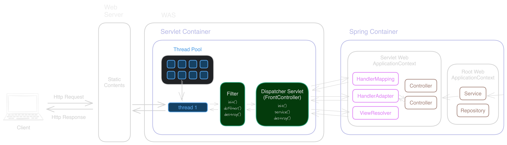
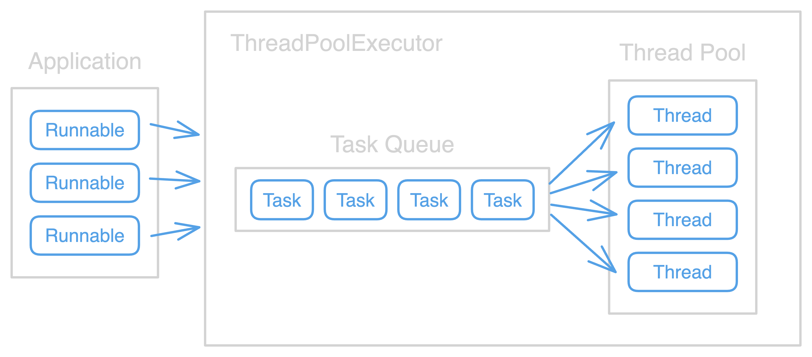

<center></center>
<br>

스프링 부트를 사용하다 보면 사실 스프링 내부에서 어떤 동작이 이루어지는지 모르더라도 원하는 비즈니스 로직 구현을 할 수 있다. 그렇기 때문에 쉽고 간편하게 서버 개발을 할 수 있지만, 결국 언젠가는 클라이언트의 요청이 정확히 어떤 방식으로 처리되는 것인지를 알아야 하는 때가 오게 되는 것 같다. 필자 또한 어느 순간부터 스프링 내부 구조와 데이터 전달/처리 과정을 공부해 봐야겠다는 필요성을 느끼게 되었고 이를 정리하는 글을 작성하게 되었다. 

우선 이 글에서 다루게 될 내용의 전체 모식도는 아래와 같다. 앞으로 각 단계에 해당하는 내용들을 차근차근 살펴볼 예정인데, 계속 이 그림으로 다시 올라오면서 지금 읽고 있는 개념이 어떤 흐름 속에 있는 것인지 확인하기를 바란다. 전체적인 맥락을 파악하며 공부해야 각 세부 정보들에 대한 이해도 더 쉽게 해낼 수 있다. 



본격적으로 그림을 살펴보자. 사용자가 서버로 HTTP 요청을 보내면 가장 먼저 이 정보는 웹 서버(Web Server)라는 곳으로 전달된다. 위 그림에서도 볼 수 있듯이 클라이언트의 요청은 우선 웹 서버로 전달되고, 이어서 그 옆에 비슷한 이름을 가진 웹 애플리케이션 서버(WAS, Web Application Server)로 연결된다. 각각의 두 서버는 유사해 보이지만 서로 다른 역할과 기능을 수행한다.

<br>

## 1. Web Server와 WAS(Web Application Server)
웹 서버(Web Server)와 웹 애플리케이션 서버(WAS, Web Application Server)는 가장 직관적으로 "*Application*"이라는 단어의 유무로 구분된다. 이 단어의 차이로 각각의 서버가 처리할 수 있는 범위와 수행하는 역할의 근본적인 차이가 있음을 알 수 있다. 

Application, 즉 "응용"을 수행할 수 있는 웹 애플리케이션 서버(WAS)는 클라이언트와 상호작용을 통해 동적인 콘텐츠를 생성하여 제공한다. 클라이언트가 요청한 데이터를 처리하기 위해 데이터베이스에 접근하거나, 복잡한 비즈니스 로직을 실행하는 중요한 역할을 담당한다. 톰캣(Tomcat)은 WAS의 대표적인 예로, 스프링 부트를 사용한 경험이 있다면 톰캣이 내장되어 별도의 설정 없이 사용해 왔을 것이다. 

반면 웹 서버(Web Server)는 WAS와 달리 정적인 콘텐츠를 제공하는 역할을 한다. 웹 브라우저와 같은 클라이언트로부터 HTTP 요청을 받으면 HTML 문서, 파일, 이미지 등과 같은, 응답 내용에 변함이 없는 콘텐츠들을 제공해 주는 일을 한다. 대표적인 웹 서버로는 아파치(Apache)와 엔진엑스(Nginx)가 있다.

사실 WAS는 웹 서버가 수행하는 정적 콘텐츠 제공의 역할까지 수행할 수 있다. 하지만 위의 전체 흐름 모식도에도 나와 있듯이 보통 웹 서비스는 WAS 앞에 웹 서버를 붙여서 같이 사용하곤 한다. 왜 굳이 WAS만으로도 충분한 것 같은데 웹 서버를 함께 사용하는 것일까? 그 이유는 여러 가지가 있는데 가볍게 살펴보면 다음과 같다. 

우선 웹 서버는 정적 콘텐츠를 처리하는 것에 최적화되어 있기 때문에 각각의 서버가 역할을 분리하여 <span style='background-color:#44729e'>부담을 줄이고 부하를 분산</span>
할 수 있다는 장점이 있다. 또한 웹 서버는 <span style='background-color:#44729e'>로드 밸런서의 역할</span>을 수행할 수 있다. **로드 밸런서**란 말 그대로 서버에 가해지는 부하(로드)를 분산(밸런싱)해주는 장치를 의미한다. 여러 WAS가 배포되어 있는 경우, 웹 서버는 들어오는 요청을 각 서버에 적절하고 균형 있게 분산해주는 일을 수행한다. 또한 웹 서버는 <span style='background-color:#44729e'>리버스 프록시 역할</span>을 하여 외부와 내부 네트워크를 격리시킬 수 있다. 리버스 프록시는 클라이언트와 서버 간 중개자 역할을 하는 서버로, 직접적인 접근을 방지하여 전체 서비스의 보안을 강화해주는 역할을 수행한다. 

정리를 해보자면, 클라이언트의 요청이 들어오면 우선 웹 서버에서 정적인 콘텐츠들에 대한 처리가 진행되고 이후 WAS로 요청이 전달되어 동적 콘텐츠를 반환해주는 것이다. 그러면 이제 조금 더 구체적으로 WAS에서 HTTP 요청에 대한 처리를 어떻게 진행하는지를 알아보도록 하자. 

<br>

## 2. 서블릿 컨테이너(Servlet Container)와 서블릿(Servlet)
다시 위의 전체 흐름 모식도를 살펴보고 오자. WAS 안에 서블릿 컨테이너(Servlet Container)라는 것이 보인다. 개발 공부를 하다 보면 **컨테이너**(Container)라는 용어를 자주 마주하게 된다. 그 의미를 먼저 짚고 넘어가자면 말 그대로 <span style='background-color:#44729e'>무언가를 담고 있는 것</span>을 의미한다. 하지만 단순히 무언가를 모아놓은 것에서 역할이 끝나는 것이 아니라 이들을 관리하는 기능까지 수행한다. 즉, 서블릿 컨테이너는 서블릿이라는 것을 담아두고 관리하는 무언가라고 생각하면 된다. 

그렇다면 **서블릿**이란 뭘까?
> A **servlet** is a Java programming language class that is used to extend the capabilities of servers that host applications accessed by means of a request-response programming model.

JavaEE 공식 문서에 적혀있는 서블릿에 대한 정의이다. 한국어로 번역해 보면 다음과 같다.

*'서블릿은 요청-응답 프로그래밍 모델을 통해 접근되는 애플리케이션을 호스트하는 서버의 기능을 확장하는 데 사용하는 자바 클래스이다.'* 

문장이 뭔가 어렵게 쓰여 있지만 정리하자면, 클라이언트와 상호작용을 하는 동적 애플리케이션을 만들기 위해서는 요청을 처리하기 위한 기술들이 필요한데, 그 기술의 기반이 되는 로우 레벨 코드를 제공해주는 클래스를 뜻한다고 보면 된다. 웹 애플리케이션의 경우 HTTP 프로토콜을 통해 주고받는 데이터에서 통신에 필요한 여러 부가적인 것들을 읽고 처리해주는 역할을 하는 것이라고 생각하면 된다. 

실제 서블릿을 동작하기 위해서는 특정 URL에 특정 서블릿 객체를 매핑하여 설정해주면 된다. 개발자는 XML 파일을 만들어 각각의 매핑 정보를 작성하거나 어노테이션을 이용하는 방식을 사용할 수 있다. 따라서 만약 HTTP 요청이 오면 WAS의 서블릿 컨테이너는 우선 요청 URL에 맞는 서블릿 매핑 정보를 확인하여 맞는 서블릿 객체를 (새로 만들거나) 호출한다. 이때 WAS는 HTTP 요청 정보로부터 Request 객체를 만들어 함께 서블릿 객체에 전달하고 이어서 비즈니스 로직을 수행하게 된다. 그리고 모든 작업이 끝나면 응답 정보를 Response 객체에 담아 클라이언트에게 보낸다. 

<br>

## 3. Dispatcher Servlet
실제로 스프링 MVC에서는 서블릿 객체를 싱글톤으로 관리한다. `Dispatcher Servlet`이라는 모든 요청을 담당하는 서블릿을 하나 두고 나머지 처리는 컨트롤러(Controller)에게 위임한다. 이를 `프론트 컨트롤러(Front Controller)` 디자인 패턴이라고 하는데, 이를 통해 개발자는 서블릿을 직접 다루지 않아도 클라이언트의 요청을 처리할 수 있게 된다. Dispatcher Servlet을 통해 스프링 컨테이너 안의 요소들로 접근할 수 있는 연결이 생기고, 서버 개발자가 작성한 비즈니스 로직 코드가 실행될 수 있게 되는 것이다. 

다시 맨 앞의 그림을 살펴보고 오자. 이제 어느 정도 흐름이 파악되기 시작할 것이다. 스프링 컨테이너 안에서의 흐름을 마무리 정리해 보자면, Dispatcher Servlet은 `Handler Mapping`을 통해 매핑된 컨트롤러를 조회한다. 이후  `Handler Adapter`로 해당 컨트롤러에 요청 내용을 전달하고 이는 Service, Repository 단에서 처리되어 응답 결과를 반환한다. 최종적으로 결과 출력을 위해선  `ViewResolver`가 호출되어 사용된다. 

<br>

## 4. 스레드 풀(Thread Pool)과 필터(Filter)
이제 마지막으로 설명을 하지 않고 넘어간 쓰레드 풀과 필터에 대해 간략하게 설명하려고 한다. 

서블릿 컨테이너의 역할을 다시 한번 떠올려보면, 서블릿 객체의 생성, 호출, 소멸 등의 라이프사이클을 직접적으로 관리해주는 일을 수행한다. 하지만 이외에도 서블릿 컨테이너는 다양한 중요한 작업들을 처리하는 역할을 한다. 

우선 웹 서버와의 통신을 가능하게 해주는 중요한 역할을 한다. 클라이언트의 요청을 받고 응답할 수 있도록 웹 서버와 소켓을 만들어 통신을 지원한다. 또한 요청을 받을 때마다 스레드를 할당하여 멀티스레드로 효율적인 운영을 할 수 있도록 지원한다. 이때 **스레드 풀**(Thread Pool)이라는 개념이 등장하는데 자세히 살펴보자. 

<br>

### 4.1. 스레드 풀(Thread Pool)



클라이언트의 요청이 들어오면 각 요청에 대해 처리해 줄 스레드가 하나씩 할당되고 이후 Dispatcher Servlet을 거쳐 요청이 처리된다. 이때 톰캣은 매번 새로운 스레드를 생성하는 대신, 미리 다수의 스레드를 만들어놓고 필요할 때마다 이 중에서 하나를 꺼내 사용하는 방식을 취한다. 이렇게 미리 생성해 둔 스레드들의 집합을 **스레스 풀**(Thread Pool)이라 한다. 매번 스레드를 생성하고 소멸하는 것은 운영체제나 JVM에 상당한 부담을 주며, 특히 동시에 다수 요청이 들어오는 경우 리소스(메모리, CPU)의 소모를 효율적으로 관리하기 어렵기 때문에 스레드 풀 개념이 도입되었다. 

스레드 풀에 대한 설정은 `application.yml` 파일에서 수정할 수 있다. 아래는 기본값으로 설정된 수치를 나타낸 것이다. 각자의 상황에 맞게 수정하여 사용하면 되고, 기본값 그대로 사용한다면 기본 세팅 값을 대략이라도 알아두도록 하자. 

```yml
server:
	tomcat:
		threads:
			max: 200 # 생성할 수 있는 thread의 총 개수
			min-spare: 10 # 항상 활성화 되어있는 thread의 개수
		max-connections: 8192 # 수립가능한 connection의 수
		accept-count: 100 # 작업 큐의 사이즈 (default : Integer.MAX)
		connection-timeout: 20000 # 커넥션 유지시간 
```
<br>

### 4.2. 필터(Filter)
어쩌다 보니 이 내용을 가장 마지막으로 작성하게 되었지만, 사실 필터를 이해하기 위해 이 글을 처음 작성하기 시작했다. 토이 프로젝트를 진행하면서 JWT 인증을 구현할 일이 생겼는데, 그 과정에서 인증 필터를 적용하게 되면서 처음으로 필터 개념을 접하게 되었다. 처음에는 필터가 무엇인지, 어떤 역할을 하는 것인지 이해해 보고자 공부를 시작하였지만, 연관된 구성 요소들을 공부하다 보니 자연스럽게 그 범위가 확장되었고 스프링 애플리케이션의 전반적인 구조를 살펴보게 되었다. 

결국 필터는 `Dispatcher Servlet`과 클라이언트 사이에서 요청/응답 데이터에 처리해야 할 부가 작업을 처리하는 기능을 하는 것이라고 보면 된다. 그렇기 때문에 요청과 응답의 순수한 정보를 확인할 수 있고 이를 알맞은 형태로 변환하는 역할을 수행한다. 따라서 주로 로깅 용도로 활용하거나 인증과 관련된 로직을 처리하는 데 활용한다. 요청 데이터를 변경하거나 응답에 특정 헤더를 추가하는 역할을 수행하기도 한다. 

사실 필터는 J2EE표준 스펙 기능으로 스프링 프레임워크와는 별개의 기술이지만, 스프링 빈으로 등록할 수 있다. 스프링 부트가 서블릿 컨테이너까지 제어 가능하기 때문인데, 구체적인 내용은 추후에 또 다뤄보기로 하자. 


---

이번 글을 작성하며 스프링 프레임워크에서 클라이언트의 요청을 어떻게 처리하는지 대략적인 과정을 살펴보았다. 전체적인 흐름을 담으려고 많이 노력했기 때문에 세부적인 내용을 전부 담지는 못했다. 그래서 부족한 부분이 아직 많은데, 앞으로 계속 공부하면서 차근차근 채워나갈 예정이다. 

<br>

<details>
<summary>🛠️ Reference</summary>
<div markdown="1">

- https://dip-mazumder.medium.com/how-to-determine-java-thread-pool-size-a-comprehensive-guide-4f73a4758273
- https://velog.io/@sihyung92/how-does-springboot-handle-multiple-requests
- https://souljit2.tistory.com/73
- https://taes-k.github.io/2020/02/16/servlet-container-spring-container/
- https://sigridjin.medium.com/servletcontainer%EC%99%80-springcontainer%EB%8A%94-%EB%AC%B4%EC%97%87%EC%9D%B4-%EB%8B%A4%EB%A5%B8%EA%B0%80-626d27a80fe5

</div>
</details>


