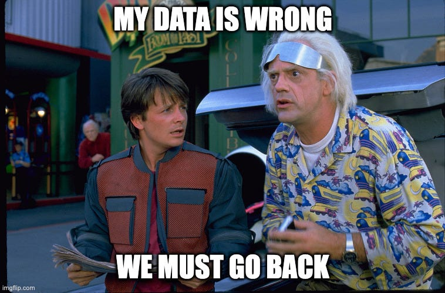
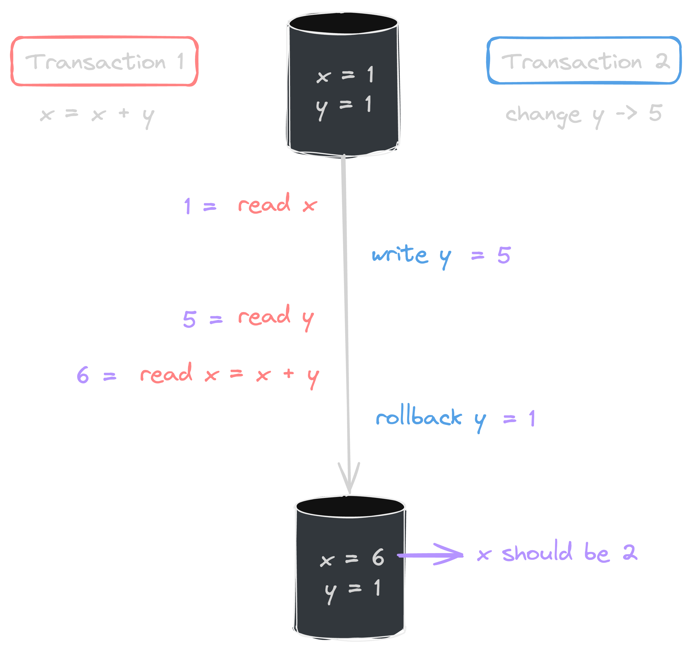
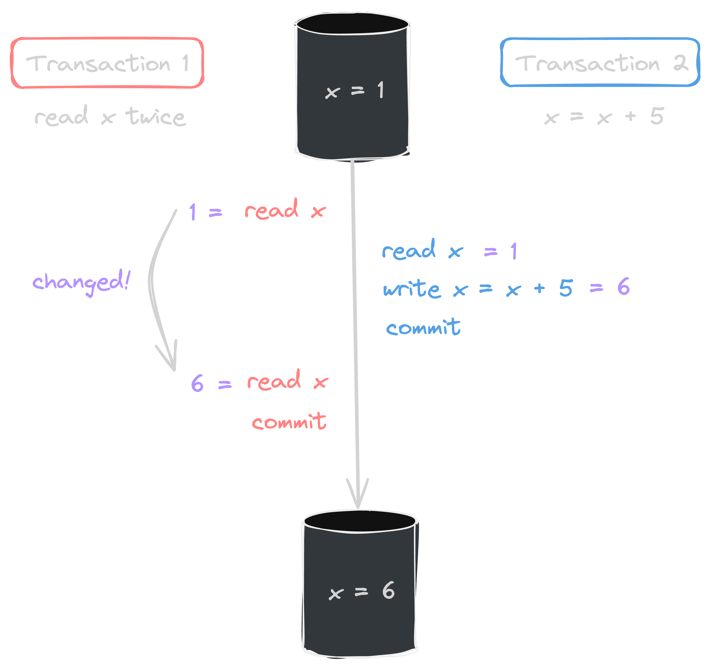

</br>

한 유명 레스토랑에서 새로운 예약 시스템을 도입하여 매일 오후 5시마다 다음 날 예약 손님 50명을 받기로 결정했다. 해당 서비스의 도입 첫날, 사람들은 마치 인기 가수의 콘서트 티켓팅을 하는 것처럼 5시만을 기다리고 있다가 동시에 예약 신청을 했고 순식간에 예약이 마감되었다. 그렇게 새로 도입한 시스템은 안정적으로 작동된 줄 알았지만, 가게 주인이 예약을 성공한 손님들의 리스트를 확인해 보니 처음 계획한 50명을 넘어서 68명의 손님이 예약되어 있었다! 가게에는 앉을 수 있는 자리가 한정되어 있고 준비된 재료도 제한되어 있기 때문에 어쩔 수 없이 가게 주인은 몇몇 손님들께 양해를 구하며 강제로 예약을 취소할 수밖에 없었다. 

이건 데이터베이스 시스템의 무결성을 유지하는 것이 얼마나 중요한지를 말하기 위해 각색한 이야기이다. 예약 신청 요청이 들어오면 설정해 놓은 정원에서 인원수를 정확히 차감하여 현재 남은 자릿수를 계산해야 한다. 하지만 데이터베이스 값을 읽고 쓰는 과정에서 무결성과 동시성을 제대로 제어하지 못하면 위와 같은 문제 상황이 발생할 수 있다. 만약 피해 규모가 더 크고 사안이 더 심각한 실제 비즈니스 상황이었다면, 기업의 신뢰성은 물론이고 손님들의 만족도 또한 크게 하락하여 큰 문제로 이어질 수도 있었을 것이다. 이러한 끔찍한 상황을 피하기위해, 우리는 데이터베이스 시스템에서 트랜잭션과 락에 대해 제대로 이해하고 사용할 줄 알아야 한다. 그럼, 본격적으로 트랜잭션에 대해 먼저 알아보도록 하자. 

</br>

## 1. 트랜잭션(Transaction)이란 무엇일까?
쇼핑몰 사이트에서 물건을 하나 주문할 때 내부에서 어떤 로직이 실행되고 데이터베이스에 정보가 저장되는지를 생각해 보자. 해당 상품에는 정해져 있는 한정된 재고량이 있을 것이고, 소비자의 주문 요청이 들어오면 요청 수량만큼 차감되어 값이 갱신되고 새로운 주문 접수가 이루어질 것이다. 그러면 백엔드 개발자 입장에서는 주문 요청이 들어왔을 때, 
1. 주문 요청 들어온 수만큼 상품 재고 차감 후 DB에 값 업데이트 
2. 새로운 주문 정보 저장

이 두 가지 일을 처리하게 된다. 이와 같이 데이터베이스의 상태를 변화시키는 작업에는 일련의 연산들이 하나의 작업 단위로 묶여 처리되곤 하는데, 이 논리적 작업 단위를 **트랜잭션**이라 한다. 

이 정도의 설명으로 트랜잭션의 간단한 개념 정도는 파악할 수 있다. 하지만 막상 프로젝트를 진행하려고 하면 '그래서 트랜잭션이 실제 코드상에선 어떻게 동작한다는 건데?', '어느 범위까지 트랜잭션을 통해 관리가 된다는 거지?' 등과 같은 의문이 생긴다. 제대로 이해하지 않은 채 무작정 `@Transactional`만 붙이고 코드를 작성하다 보면, 문제가 생겨도 원인을 찾지 못하고 오랜 시간을 헤매게 될 수 있다. 그래서 스프링 컨테이너에서의 트랜잭션을 조금 더 자세하게 알아보려고 한다. 

</br>

### 1.1. 트랜잭션은 구체적으로 어떻게 동작하는 걸까?
트랜잭션의 동작 방식을 알아보기 전에 우선 **영속성 컨텍스트**를 알아야 한다. 스프링 공부를 해봤다면 아마 이 개념을 많이 들어봤을 것이다. 간단히 말해서 영속성 컨텍스트는 데이터베이스로부터 데이터를 읽어온 후 이를 객체로 변환하고 메모리에 유지하며 관리하는 역할을 하는 것이라고 할 수 있다. 멀리 저장되어 있는 정보를 가까이 가져와 조금 더 빠르고 쉽게 관리하며 사용하는 것이라고 간단히 생각해 볼 수 있겠다. 

스프링 컨테이너에서 트랜잭션의 범위는 영속성 컨텍스트의 생존 범위와 같다. 조금 더 풀어서 설명하자면, `@Transactional` 어노테이션이 붙어있는 메소드를 실행할 때 먼저 트랜잭션이 시작되어 영속성 컨텍스트가 생성되고, 해당 메소드가 정상 종료되면 트랜잭션을 커밋하면서 영속성 컨텍스트도 종료된다. 같이 실행되어 생성되었다가 같이 종료되는 것이다. 아래 그림과 예제를 보면 트랜잭션의 범위와 동작 순서를 더 쉽게 이해할 수 있을 것이다. 


```java
@Service
@RequiredArgsConstructor
class HelloService {
	
	private final HelloRepository memberRepository;

	// 1. 트랜잭션 시작 -> 영속성 컨텍스트 생성
	@Transactional
	public void hello() {
		// 2. member는 영속 상태
		Member member = memberRepository.findMember();
		return member
	}
	// 3. 트랜잭션 종료 -> 영속성 컨텍스트 종료
}

@Repository
@RequiredArgsConstructor
class HelloRepository {

	private final EntityManager em;

	public Member findMember(){
		return em.find(Member.class, "id1"); // 영속성 컨텍스트 접근 
	}
}
```

예제를 보며 차근차근 과정을 따라가 보자. 
1. 어떤 Controller에서 HelloService의 hello() 메소드를 호출하면 트랜잭션이 먼저 실행된다. 
2. memberRepository로 조회한 member 엔티티는 트랜잭션 범위 안에 속해 있으며, 영속성 컨텍스트에 의해 관리된다. 
3. 해당 메소드가 정상적으로 종료되면 트랜잭션도 커밋하고 종료하게 되는데,
4. 이때 JPA는 먼저 영속성 컨텍스트를 플러시 해서 데이터베이스에 변경 사항을 반영한 후, 데이터베이스 트랜잭션을 커밋한다. 
5. 만약 예외가 발생했다면 트랜잭션을 롤백하고 종료하고, 이때는 플러시를 호출하지 않는다.

이와 같은 방식으로 작동하는 트랜잭션이 가지는 한 가지 특징이 있다.  
> 트랜잭션이 같으면 같은 영속성 컨텍스트를 사용하고, 트랜잭션이 다르면 다른 영속성 컨텍스트를 사용한다. 

당연한 얘기를 하고 있는 것 같지만 꽤 중요한 특징이라고 할 수 있다. 스프링 컨테이너는 여러 스레드에서 동시에 요청이 오면 각 스레드마다 다른 트랜잭션을 할당한다. 따라서 같은 엔티티 매니저를 사용하고 있다고 해도 트랜잭션이 다르면 (스레드가 다르면) 다른 영속성 컨텍스트를 사용하게 된다. 그래서 멀티스레드 환경에서도 안전하게 동작할 수 있다. 스프링 컨테이너는 이와 같이 복잡한 멀티 스레드 상황을 알아서 처리해 주기 때문에, 개발자들은 싱글 스레드 환경처럼 생각하고 단순하게 개발할 수 있게 된다. 


</br>

### 1.2. ACID 특성
트랜잭션의 개념을 설명할 때 거의 빠지지 않고 등장하는 중요한 속성이다. ACID는 원자성<sup>Atomicity</sup>, 일관성<sup>Consistency</sup>, 격리성<sup>Isolation</sup>, 지속성<sup>Durability</sup>을 의미하며 데이터베이스 트랜잭션의 안전성을 위해 보장하기 위해 꼭 지켜져야 하는 성질이다. 이 글에서 다루고 싶은 내용은 격리성<sup>Isolation</sup>이기 때문에 다른 특성들은 가볍게 정리하고 넘어가려고 한다. 

- 원자성 </br>
	: All or Nothing. 트랜잭션 내에서 실행한 작업들은 부분적으로 실행될 수 없고, 모두 성공하거나 모두 실패해야 한다.
- 일관성 </br>
	: 트랜잭션이 완료되었을 때 항상 일관성 있는 데이터베이스 상태를 유지해야 한다. 데이터베이스에서 정한 무결성 제약 조건들을 항상 지켜야 한다. 
- 격리성 </br>
	: 동시에 트랜잭션이 실행되었을 때, 서로에게 영향을 주지 않도록 격리해야 한다. 
- 지속성 </br>
	: 성공적으로 끝난 트랜잭션의 결과가 항상 기록되어야 한다. 

트랜잭션은 다양한 방법들(롤백 세그먼트, 트리거 등)을 이용해서 원자성, 일관성, 지속성을 보장한다. 그 구체적인 방법들은 다음에 자세히 다뤄보기로 하고 우선 격리성에 집중해 보자. 

트랜잭션의 격리성을 완벽하게 보장하기 위해서는 각각의 트랜잭션을 하나씩 차례로 실행하는 방법이 있는데, 이 경우에는 동시성 처리 성능이 매우 떨어지게 된다. 반대로 동시성 처리 성능을 높이려고 하면 데이터베이스 정보를 다룰 때 서로에게 영향을 끼쳐 여러 문제가 발생할 수 있다는 위험이 있다. 따라서 적용하고자 하는 비즈니스 로직에 따라 격리 수준을 다르게 설정하여 적용해 주어야 하고, 발생할 수 있는 문제들을 확실히 인지하여 알맞게 대응해야 한다. 

트랜잭션의 격리 수준<sup>isolation level</sup>은 ANSI 표준에 따라 다음과 같이 4단계로 나누어 정의된다. 각 수준에 따라 발생할 수 있는 문제점들과 함께 정리하여, 어떤 상황에서 어떤 수준이 적합할지를 직접 느껴보면 좋을 것 같다. 

|    격리 수준     | Dirty Read | Non-Repeatable Read | Phantom Read |
|:----------------:|:----------:|:-------------------:|:------------:|
| Read Uncommitted |     O      |          O          |      O       |
|  Read Committed  |            |          O          |      O       |
| Repeatable Read  |            |                     |      O       |
|   Serializable   |            |                     |              |

위 표의 순서대로 `Read Uncommitted`의 격리 수준이 가장 낮고 `Serializable`이 가장 높다. 하나씩 자세히 살펴보자. 

- **Read Uncommitted** </br>
	영어 번역 그대로, 커밋하지 않은 데이터를 읽을 수 있다는 것이다. 즉 어떤 트랜잭션에서 데이터를 수정했고 아직 커밋이 완료되지 않은 상태지만, 다른 트랜잭션에서 수정된 데이터를 조회할 수 있다는 것이다. 	
	
	위 예에서와 같이 트랜잭션 2에서 y 값을 수정한 후 아직 커밋하지 않았음에도 트랜잭션 1에서 수정 중인 데이터를 조회할 수 있다. 이를 Dirty Read라고 하는데, 트랜잭션 2에서 롤백하는 상황이 생기면 y 값은 1로 다시 돌아오는 반면, x 값은 트랜잭션 1에서 이미 바뀐 y의 값으로 연산이 진행되기 때문에 2 대신 6으로 처리된다. 따라서 이 경우 데이터 정합성에 심각한 문제가 발생할 수 있다. 

- **Read Committed** </br>
	커밋한 데이터만을 읽을 수 있다. 따라서 위와 같은 Dirty Read 문제는 발생하지 않는다. y 값이 중간에 변경되어도 커밋이 완료되지 않았다면 다른 트랜잭션에서 조회되지 않기 때문이다. 
	
	대신 Non-Repeatable Read 문제가 발생한다. 위 그림에서와 같이 트랜잭션 1에서는 x를 두 번 읽는 작업을 하고, 트랜잭션 2에서는 x 값을 수정하는 작업이 진행되는 상황을 떠올려보자. 만약 트랜잭션 1에서 x 읽기 한 번을 수행한 후에 트랜잭션 2의 수정 작업이 모두 끝나 커밋까지 완료했다면, 두 번째 x 값을 읽을 때는 이전 결과와 다른 값이 조회될 것이다. 이처럼 한 트랜잭션 안에서 읽었음에도 값이 달라지는 경우를 Non-Repeatable Read라 한다. 

- **Repeatable Read** </br>
	트랜잭션 안에서 한 번 조회한 데이터를 반복해서 조회하면 같은 데이터가 읽힌다. 하지만 추가적으로 이전에 없었던 데이터가 새로 생기는 현상이 발생할 수는 있다. 이를 Phantom Read 문제라 한다. 
	
	위의 예에서 트랜잭션 1은 val 값이 10인 데이터를 두 번 읽는 작업을 수행하고 트랜잭션 2에서는 m2 객체의 val 값을 10으로 바꾸는 작업을 한다. 트랜잭션 1에서 한 번 읽기 작업이 수행되면 m1 객체가 조회된다. 하지만 두 번째 읽기 작업이 시작되기 전에 트랜잭션 2에서 커밋이 완료되면, m1과 m2 모두 val 값이 10이 되기 때문에 m2 객체 하나가 추가되어 첫 번째 조회 결과 집합과 달라지게 된다. 
	
- **Serializable** </br>
	트랜잭션을 그냥 순차적으로 진행시킨다. 가장 엄격한 격리 수준을 가지며 동시 처리 성능이 매우 떨어진다. 

글을 읽다 보면 느낄 수 있듯이 트랜잭션 격리 작업은 데이터베이스 처리의 가장 기본이 되는 것 중 하나이다. 따라서 각 오픈소스 데이터베이스(MySQL, PostgreSQL, MariaDB 등)에서는 기본으로 사용하고 있는 격리 수준을 명시하고 있고, 사용자가 직접 지정할 수도 있도록 지원하고 있다. 
그렇다면 스프링 프레임워크에서는 어떤 방식으로 설정이 되어 있는지 궁금해져 `Transactional` 어노테이션을 살펴보았다. `Transactional` 안에 `Isolation`은 기본 `DEFAULT`로 설정되어 있고, 초록색 주석 부분을 읽어보면 이 `DEFAULT`는 underlying datastore, 즉, 사용하고 있는 데이터베이스 격리 수준을 그대로 따르도록 설정되어 있음을 확인할 수 있었다. 


대부분의 애플리케이션에서는 동시성 처리가 중요하기 때문에 `Read Committed`를 사용하고 `Repeatable Read`도 많이 선택한다. 하지만 더 높은 수준의 격리가 필요한 비즈니스 로직에는 데이터베이스 트랜잭션이 제공하는 락(Lock) 기능을 추가로 사용하게 되는데, 이어서 자세히 살펴보려고 한다. 

</br>

## 2. 더 높은 격리 수준이 필요하다면, 락(Lock)을 사용하자 
앞에서 언급한 트랜잭션 격리 수준이 전부는 아니다. `Read Committed` 격리 수준을 사용해도 락(Lock)을 이용하면 `Repeatable Read(반복 가능한 읽기)`가 가능하게 만들 수 있다. 구체적으로 살펴보면, 우선 락의 종류에는 낙관적 락(Optimistic Lock)과 비관적 락(Pessimistic Lock)이 있다.

</br>

### 2.1. 낙관적 락(Optimistic Lock)
**낙관적 락**은 이름을 통해서도 알 수 있듯이, 대부분의 트랜잭션에서 충돌이 발생하지 않을 것이라고 낙관적으로 가정한 상태에서 충돌에 대비하는 방식이다. 충돌이 발생하지 않을 것이라고 가정했기 때문에 일단 작업을 진행했다가 커밋할 때 충돌이 일어났는지를 확인하게 된다. 낙관적 락은 JPA가 제공하는 버전 관리 기능을 사용하여 동작하고 `@Version` 어노테이션을 통해 간단히 구현할 수 있다. 

```java
@Entity
public class Board {

	@Id
	private String id;
	private String title;

	@Version
	private Integer version;
}
```

버전 관리 기능은 위의 예처럼 락을 적용하고자 하는 엔티티에 버전용 필드를 하나 만들고 위에 `@Version` 어노테이션만 붙여주면 된다. 해당 필드의 타입은 `Integer` 외에도 `Long`, `Short`, `Timestamp`가 가능하다. 
버전을 이용해서 충돌을 인지하는 방법은 매우 단순하다. 우선 엔티티의 상태가 변경될 때마다 버전이 자동으로 하나씩 증가한다. 그리고 엔티티를 수정할 때는 처음 조회 시점의 버전과 커밋할 때 마지막 시점의 버전을 비교하여 그 값이 다르면 예외가 발생한다. 예를 들어 만약 트랜잭션 1에서 Board 엔티티를 수정하는 도중, 동시에 트랜잭션 2에서 같은 엔티티를 수정하고 커밋하여 버전이 증가해 버렸다면, 트랜잭션 1의 마지막 커밋 시점에서 바뀐 버전 정보가 읽히기 때문에 예외가 발생하게 된다. 아래 예에서는 트랜잭션 2에서 title 값이 변하면서 버전이 2로 증가했기 때문에, Transaction 1에서 예외가 발생하게 된다. 따라서 낙관적 락에서와 같이 버전 정보를 사용하게 되면 최초의 커밋만을 인정하는 방식으로 작동한다. 


조금 더 구체적으로 보면, 엔티티 수정 후 트랜잭션을 커밋하면 영속성 컨텍스트를 플러시 하면서 UPDATE 쿼리가 실행된다. 
```mysql
UPDATE BOARD
SET
	TITLE='B',
	VERSION=2 (버전 증가하기)
WHERE
	ID=1,
	AND VERSION=1
```
UPDATE 쿼리는 다음과 같이 구성되는데 WHERE 문을 통해 기존 버전과 값을 비교하고 값이 같으면 버전을 하나 증가시키고 아니면 예외를 발생시킨다. 

기본적으로 `@Version`만 적용했을 때는 엔티티의 값에 수정이 생겼을 때 버전이 증가한다. 만약 엔티티를 조회만 해도 버전을 체크하고 싶다면, `OPTIMISTIC` 옵션을 추가해 주면 된다. 이 방식을 사용하면 `Dirty Read`와 `Non-Repeatable Read`를 방지할 수 있다는 이점이 있다. 또한, 연관관계 필드의 경우 외래 키를 관리하는 연관관계의 주인 필드를 수정할 때만 버전이 증가한다. 만약 강제로 버전 정보를 증가하여 원하는 대로 관리하고 싶다면 `OPTIMISTIC_FORCE_INCREMENT` 옵션을 사용해 주면 된다. 

</br>

### 2.2. 비관적 락(Pessimistic Lock)
**비관적 락**은 트랜잭션의 충돌이 발생할 것이라고 비관적으로 가정하여 우선 락을 걸고 보는 방법이다. JPA의 버전 관리 기능을 사용하는 낙관적 락과 달리 데이터베이스가 제공하는 락 메커니즘을 사용하며, 데이터 수정 즉시 충돌을 감지하게 된다. 대표적으로 SQL 쿼리의 `select for update` 구문을 사용하며 시작한다. 

비관적 락에는 `PESSIMISTIC_WRITE`, `PESSIMISTIC_READ` 옵션이 있는데, 일반적으로는 `PESSIMISTIC_WRITE` 모드를 사용한다. 

- **PESSIMISTIC_WRITE** </br>
	데이터베이스에 쓰기 락을 거는 옵션이다. 쉽게 생각하면, '나 데이터 **쓰기** 작업하려고 락(Lock) 걸거야!'라고 선언하는 것이라 생각하면 된다. 따라서 트랜잭션 1에서 쓰기 락을 가져갈 경우, 트랜잭션 2에서는 해당 데이터가 변경될 수 있기 때문에 락이 풀릴 때까지 읽기, 쓰기 둘 다 불가능하다. 
- **PESSIMISTIC_READ** </br>
	데이터베이스에 읽기 락을 거는 옵션이다. 쓰기 락과는 달리 '나 데이터 **읽기** 작업하려고 락(Lock) 걸 거야!'로 이해하면 쉽다. 따라서 트랜잭션 1에서 읽기 락을 가져갈 경우, 트랜잭션 2에서 해당 데이터를 읽는 것은 데이터의 일관성에 아무런 문제가 없기 때문에 가능하다. 하지만 데이터를 쓰는 것은 값에 변화가 생겨 트랜잭션 1과 달라질 수 있으므로 불가능하다. 

</br>

길고 긴 여정을 통해 트랜잭션과 락에 대한 기본 지식을 익히는 시간을 가졌다. 중간중간 생략하거나 넘어간 설명들이 있었지만, 이 정도면 주요한 개념들을 이해하는 데 큰 도움이 되었을 것이라 생각한다. 
이 여정의 결론에서 도달한 핵심은 '데이터베이스 관리에서 동시성과 무결성 사이의 적절한 균형이 중요하다'는 것이다. 그리고 이 균형을 설정하고 유지하기 위해서는 트랜잭션과 락을 제대로 이해하고 적절하게 활용할 줄 알아야 한다. 
글을 써가며 최대한 예를 들어 설명을 자세히 적으려고 노력했다. 이를 통해 자신의 프로젝트 상황에 따라 잘 판단하여 현명하게 데이터베이스를 관리할 수 있기를 바란다. 
